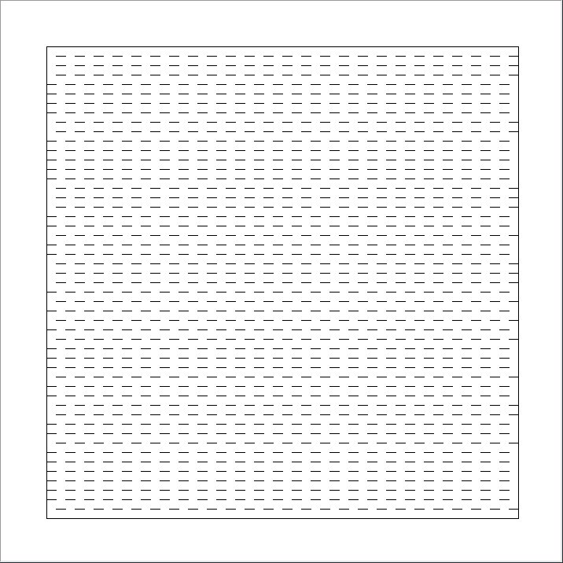
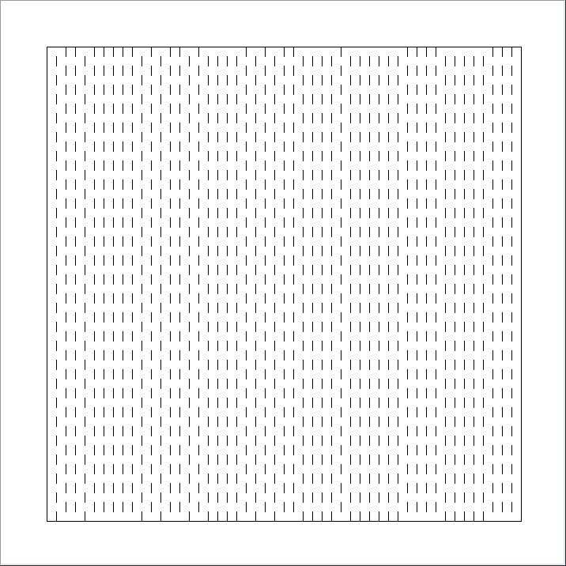
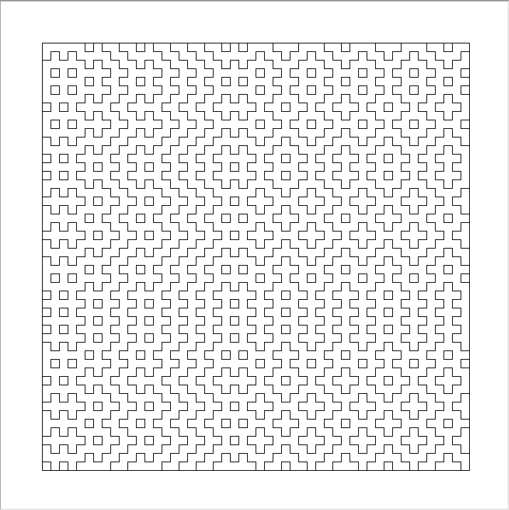

#### Made by Nikhil Ivaturi

# What is Hitomezashi?
Hitomezashi is a form of stitching clothes that appreciates the beauty of fixing broken things. It uses a grid of alternating (on-top/underneath fabric) stitches going in both axes to generate an interesting pattern.

This program is a realization of this technique, using Python and Turtle graphics to procedurally generate a visual Hitomezashi stitch. It will display a window containing the stitch in black and white.

# Inspiration:
This program was inspired by the following Numberphile video about the same topic: https://www.youtube.com/watch?v=JbfhzlMk2eY&t=29s&ab_channel=Numberphile

# How it works:
Each stitch is a series of lines with spaces between them. A stitch can either start with a space or a line, but will continue alternating until the end of the screen.

1. First, a series of row-wise stitches are made.
    * This can be done randomly (as it is in this program by default)
    * or through some "seed" text, which will use the vowel-ness of each letter in the text to determine how to start the stitch

2. Then, the same is done for a series of column-wise stitches

3. Finally, the two are overlaid to produce the cool pattern

# Usage:
!IMPORTANT!: If you are using a Windows computer, type "py" instead of "python3".
If you are still experiencing an issue with running the file, try completely removing the first line of `hitomezashi_master.py`.
Info about how to use the program can be found by running the following: `python3 hitomezashi_master.py help`

# Sample inputs (that you should definitely try):
* `python3 hitomezashi_master.py 600 50 'ab' 'ab'`
* `python3 hitomezashi_master.py 600 50 'aba' 'ab'`
* `python3 hitomezashi_master.py 600 50 'aba' 'bab'`
* `python3 hitomezashi_master.py 600 50 'ba' 'a'`
* `python3 hitomezashi_master.py 600 50 'change da world' 'my final message. Goodb ye'`
* `python3 hitomezashi_master.py 600 50 'mary had a little lamb' 'EIEIO'`

# Note:
There are 2 files in this program. "hitomezashi_master.py" is the one that should be executed. "hitomezashi2.py" will *not* run by itself.

This program can also become exceptionally slow with large inputs for screen size and/or grid size. Refer to the help text to see what to do in this scenario.

# Limitations:
Currently, it's hard to customize the outcome. The only variables factors are screen size, grid size, and seeds. It would be nice to also have color options, line thickness, maybe even some marching-squares to smooth out the lines... Also, it's inconvenient that the images are rendered in postscript and need to be externally converted to jpeg/png. It would be nice to do that to begin with.
